<!-----

You have some errors, warnings, or alerts. If you are using reckless mode, turn it off to see inline alerts.
* ERRORs: 0
* WARNINGs: 0
* ALERTS: 14

Conversion time: 3.677 seconds.

Using this Markdown file:

1. Paste this output into your source file.
2. See the notes and action items below regarding this conversion run.
3. Check the rendered output (headings, lists, code blocks, tables) for proper
   formatting and use a linkchecker before you publish this page.

Conversion notes:

* Docs to Markdown version 1.0β33
* Mon Nov 28 2022 22:10:45 GMT-0800 (PST)
* Source doc: Writeup
* This document has images: check for >>>>>  gd2md-html alert:  inline image link in generated source and store images to your server. NOTE: Images in exported zip file from Google Docs may not appear in  the same order as they do in your doc. Please check the images!

----->

# Global Analysis of Animated Shows

Amadeus Salazar

Brenda Kong

Riwaj Khadka

Alex Labenz

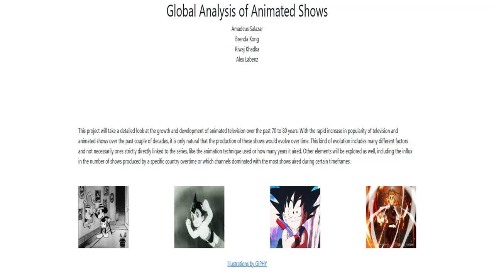

**Overview**

Our project will use a dataset found from Kaggle in order to look into how animated television shows have evolved over the past 70 to 80 years. The dataset used holds data from two separate timeframes, one from 1948 to 1986 and another from 1987 to 2022. Both sets contain the basic information of an animated series including the name, the number of seasons and episodes, the country it was released in, and the timeframe that it ran for. The second set also contains additional information on what channel it first aired on and the animation technique it used. With the use of multiple visualizations, this project mostly focuses on telling a story in regards to how some of these aspects change with time. For example, which countries lead in the production of shows by 2022 or how certain animation techniques’ popularity fluctuated as time went on. There were a total of six visualization used to help narrate these trends, a bubble chart and world map were both used to help illustrate how many shows each country released, a lollipop chart for how many shows were released by a channel, a pie chart to count up how many shows used a certain technique, an area chart to convey how popular these techniques were at a given time, and a scatterplot to show the correlation between the series’ total runtime and number of episodes.

**Data Description**

URL: https://www.kaggle.com/datasets/iamsouravbanerjee/animated-television-show?select=1987+-+2022.csv

Domain/Description: The database is a csv file that contains various animated television shows from all over the world and its intended users would be any individual who shows an interest in animation beyond simply watching it. For example, this could be students that are studying digital media or computer animation.

Data:

Attribute: Title, Type: Categorical, Cardinality: 2427

Attribute: Seasons, Type: Ordered Quantitative, Cardinality:9-1 =  8

Attribute: Episodes, Type: Ordered Quantitative, Cardinality: 99-1 = 98

Attribute: Country, Type: Categorical, Cardinality: 195

Attribute: Premiere Year, Type: Ordered Quantitative, Cardinality: 2022 - 1987 = 35

Attribute: Final Year, Type: Ordered Quantitative, Cardinality: 35

Attribute: Original Channel, Type: Categorical, Cardinality: 2225

Attribute: Technique, Type: Categorical, Cardinality: 3

**Goals and Tasks**

The goal of this project was to allow its target users to see trends and patterns following various attributes of animated shows that are otherwise unseen from just using the raw dataset. For example, a user may want to see which animation technique is the most used and this project should be able to show them. Other tasks the user can complete with our project is seeing how many shows each country has released, how many shows aired on a specific channel, how the number for each animation technique changed over the years, and how many episodes were released within the active years of a series.

**Idioms**

The UI created by the team was a simple singled column centered design wherein all the content is presented. The content followed the classic header, body, and footer tier layout. The body was sectioned into 2 columns, on the left all visualizations, and on the right all of the respective narratives.

Visualization 1

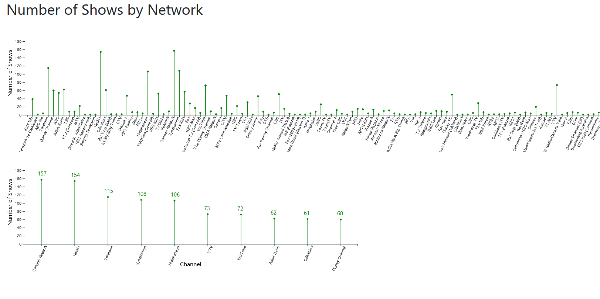

A **lollipop chart** that allows a user to discover the animated channels with the most shows released. The encodings of the chart were vertical lines with small circles at the top. The lollipop-style encoding was used for this visualization because the team believed that extreme data points would stand out more.

Visualization 2

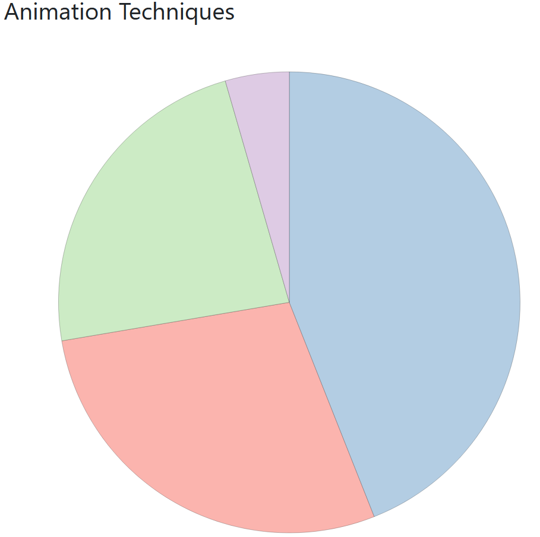

A **pie chart** that presents the distribution of animation techniques. The encodings of the chart are a circle partitioned into sections that represent the proportion of the animation techniques used. This mark encoding was used to highlight the distribution of techniques across our 80-year timeline. Different colors were assigned to each section of the pie chart in order to promote easy visual differentiation.

When a user hovers over a section of the chart it is outlined and the corresponding animation technique is rendered on the section.

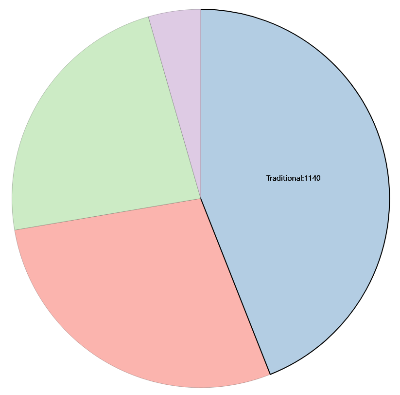

Visualization 3

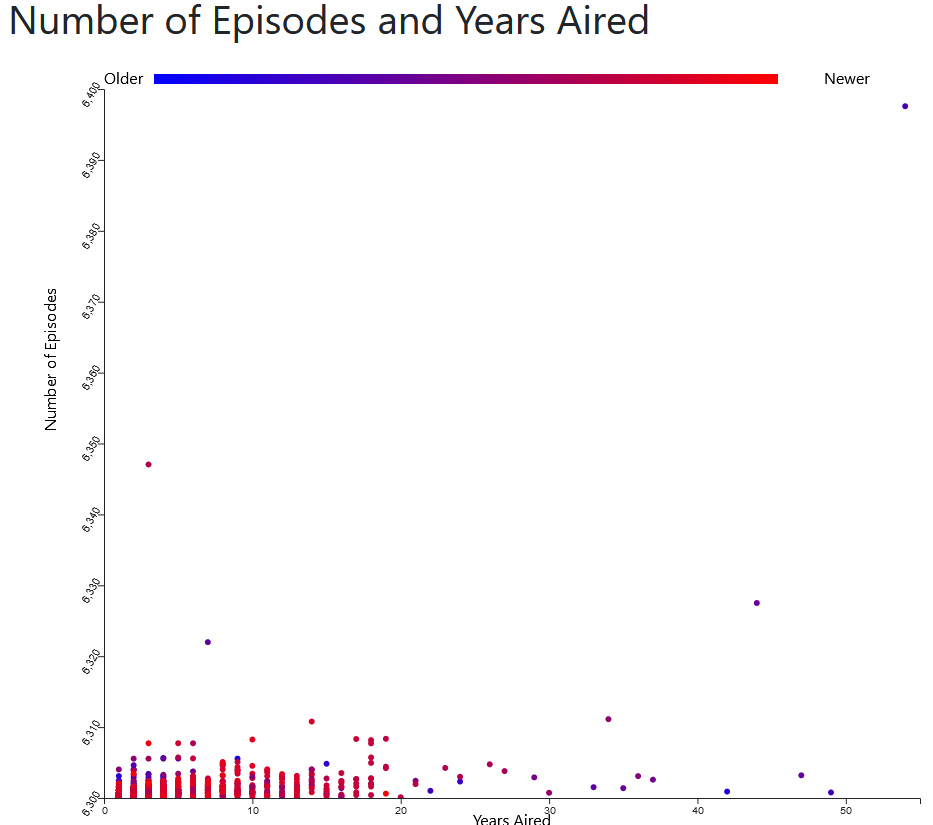

A **scatter plot** that allows the user to discover correlations between the number of episodes released by a show and the total air time of the show. The chart is comprised of small filled-in circles that each represent a data point. A color scale is used to define the ‘age’ of each show/data point.

The visualization has three interactions; one occurs when the user uses their mouse wheel, it causes the chart to zoom in on certain portions pertaining to the current narration text. The second interaction allows the user to select a region of the chart to zoom into. The last interaction renders a tooltip when the user hovers over a data point, the tooltip contains data on the point.

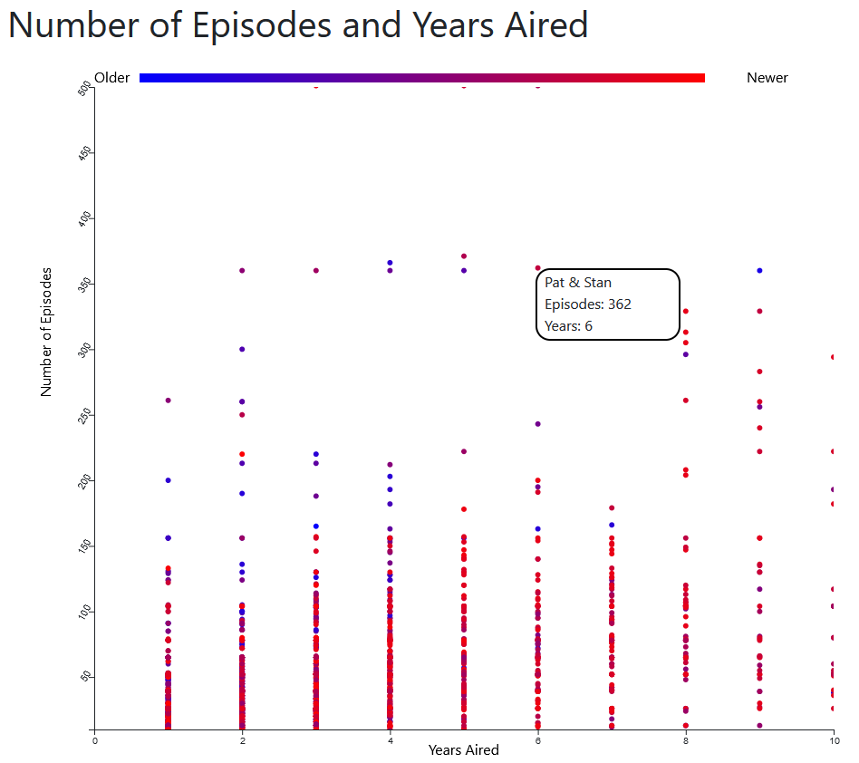

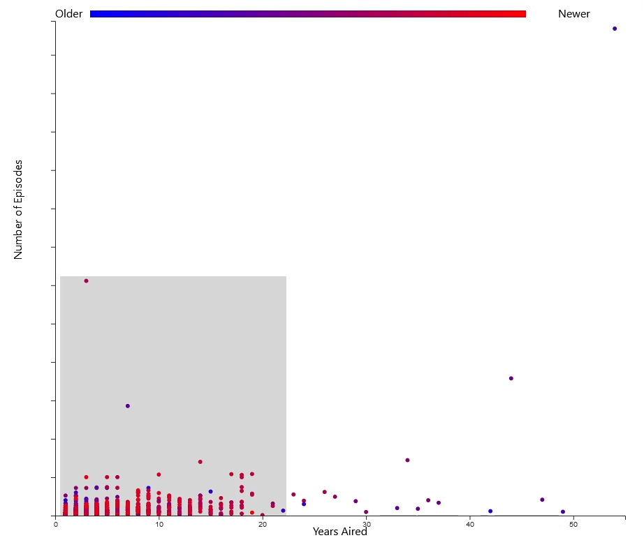

Visualization 4

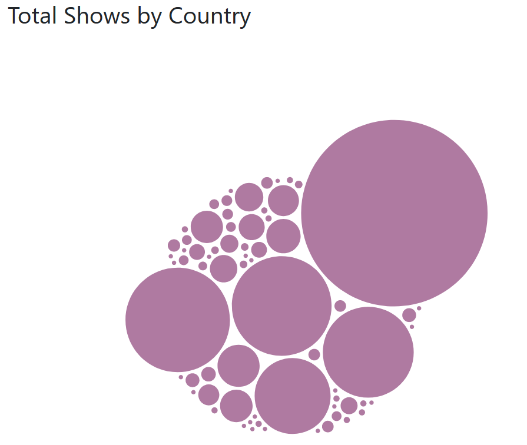

A **bubble chart** that allows a user to discover the counties with the most animated shows released. The encodings for the chart consist of circles that represent countries and the diameter of the circles represents how many shows they have released. Knowing that it is sometimes difficult to compare the size of circles in bubble charts the top five countries were filled with different colors.

One of the two interactions implemented on the chart was the highlighting of the top five countries when the user scrolls with their mouse wheel. The last one is a hover interaction that renders a tooltip near the user's mouse while over a ‘country bubble’. In addition to the tooltip the ‘country bubble’ is outlined.

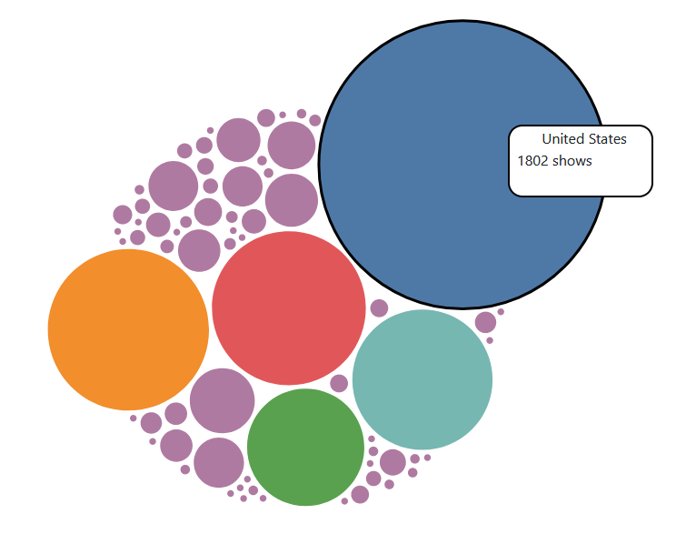

Visualization 5

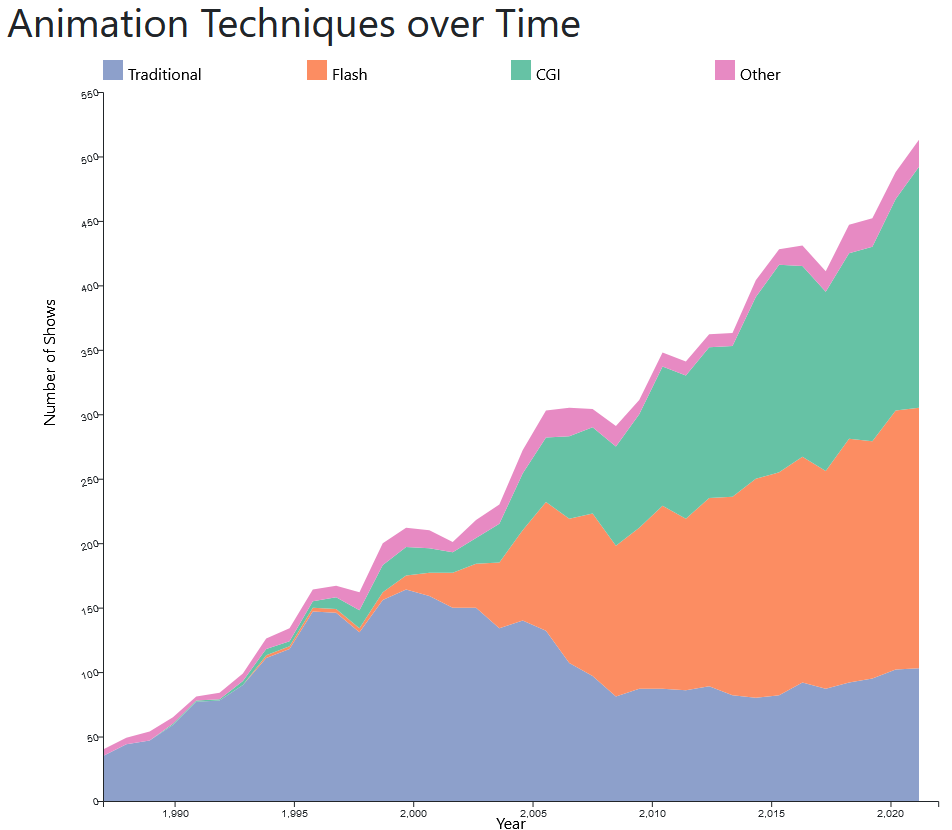

A **stacked area chart** that allows the user to discover trends about the number of shows released over time. The encoding mark for this chart are the lines that represent each animation technique. This mark was chosen in order to present the user with the animation techniques over time. Areas under the lines were added and filled by a pre-defined color scheme so that the scroll interaction would be more apparent.

While the visualization is in view the user can scroll and have the chart proceed through a sequence of highlighting animations. The user also has the ability to zoom in and out in the chart by selecting a region of the chart or double-clicking the left mouse button.

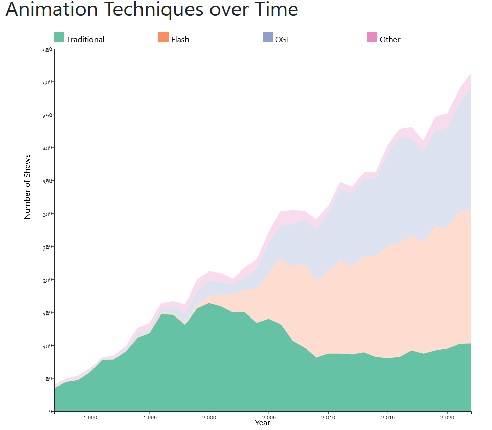

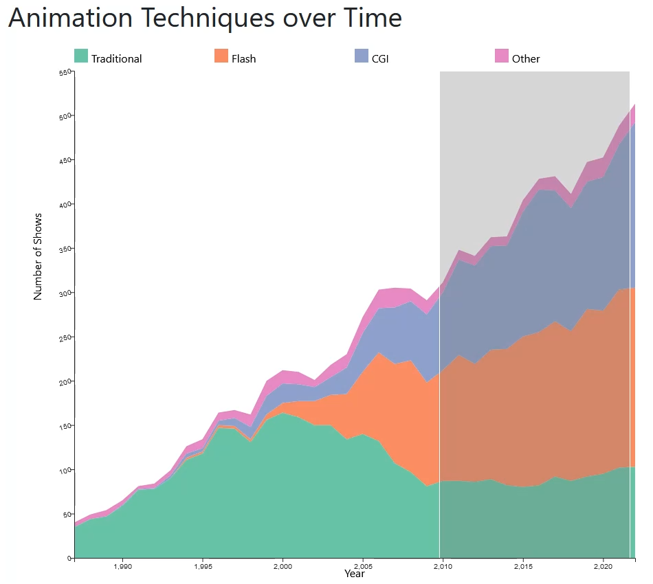

Visualization 6

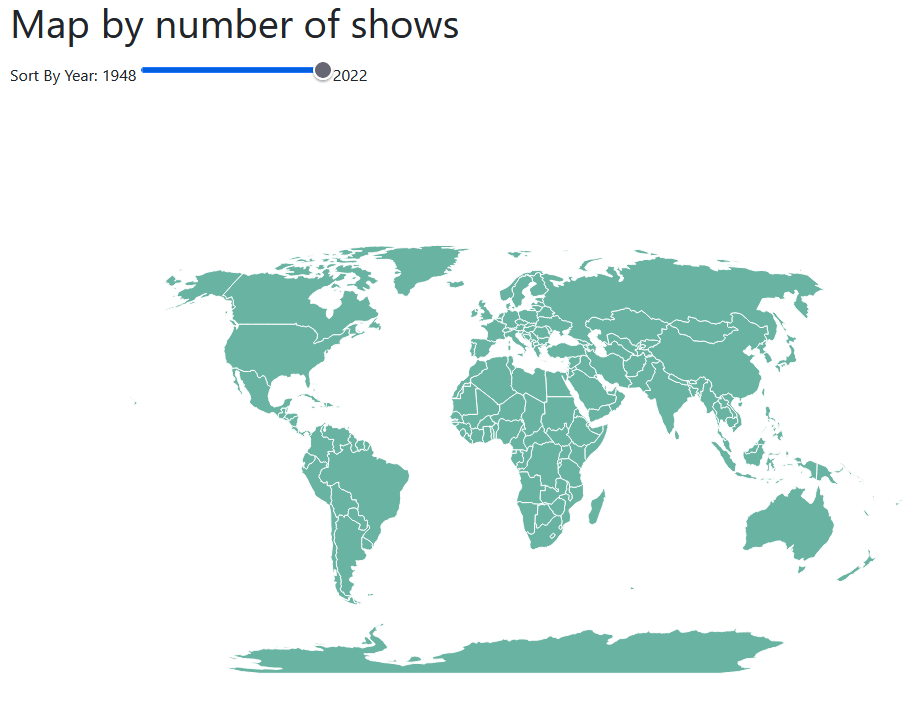

An **animated world map** that allows the user to discover similarities and differences between countries. The world map was the only mark used and was chosen to help the user better identify countries.

When the user hovers over a country on the world map a tooltip appears with the country's total number of shows for the given year. The user has the ability to change the year for which the total number of shows are being displayed in the tooltip by moving the slider above the world map.

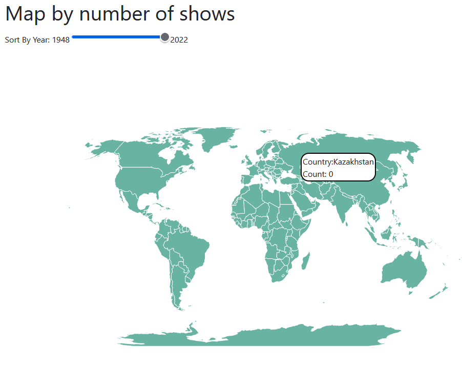

Lastly, with all visualizations, a scroll interaction was added to animate the narrative as the user scrolled through the application.

**Reflection**

Overall, the majority of the project did not deviate too much between stages. From the initial proposal to the work in progress stage, there were a few major changes with one regarding the innovative view. The original proposed idea for the innovative view did not work with the parameters of the project so the idea had to be changed*. The second change was switching the bar chart for visualization 4, which displayed the number of shows each country released, to a bubble chart as there was already another visualization using a lollipop chart which was essentially just a stylized bar chart. Then from the work in progress stage to the final product, there had been a couple of small implementations on some of the visualizations due to there being heavy outliers in some of the data. As a result of these outliers, a scrolling function was implemented on some of the graphs so that all data could be seen easily. The original proposal was still feasible and certain changes were only made to fit the project parameters. However, there were some unexpected issues when it came to working with the dataset we found. For one, the country names were not all consistent and a function had to be made to make sure that each country only appeared under one name. Another issue was how the data for channels was done as some shows aired for the first time on multiple channels. As a result, a modified dataset which separated the channels for each show had to be created. As for what would be done differently next time, knowing for sure which visualizations were just modified versions of each other would be helpful so we wouldn’t have to change one in the middle of working on the implementation.

**Team workload**

Amadeus Salazar

Created the layout of the application and wrote the template code for the team to work in. He implemented the bubble chart visualization along with its corresponding narrative. He wrote the proposal’s idioms section and the final write-up idioms section.

Brenda Kong

Created the lollipop chart and physical poster. They also wrote the proposal’s project time table, final writeup overview, data description, goals & tasks, reflection, and the application’s intro and part of the conclusion.

Riwaj Khadka

Implemented the pie chart as well as the animated world map visualization. They also wrote the proposal’s domain and data sections.

Alex Labenz

Implemented the scatter chart and stacked area chart visualizations, as well as the accompanying animations and narratives. They also helped implement the narratives for several of the other charts.
